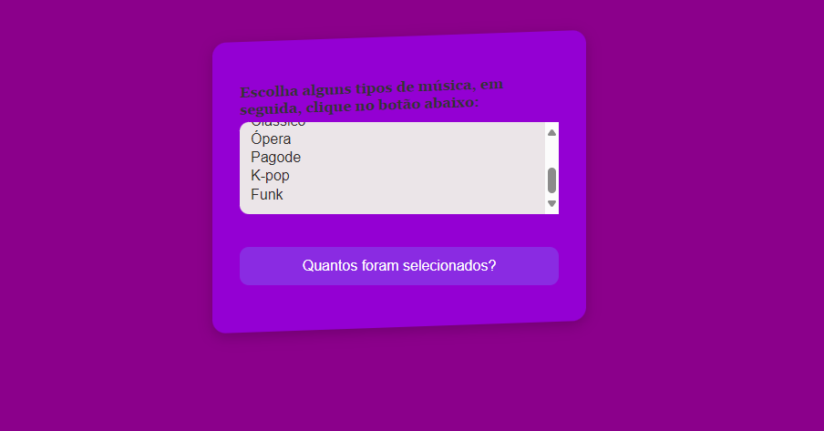

# FORMULARIO DE SELEÇÃO DE MÚSICA🎶

Esse formulario você pode escolher a música do seu gosto!😊

⚙️FUNCIONALIDADE DOS CÓDIGOS⚙️

*  No HTML:
   - Um formulário é criado com o atributo `name="selectForm"`.
   - Um campo de seleção (`<select>`) é definido com o ID `tipoMusica`, permitindo seleção múltipla (`multiple="multiple"`).
   - Opções de músicas são listadas dentro do campo de seleção.
   - Um botão é adicionado com o ID `btn` para disparar a ação de contar as seleções.
 
* No JavaScript:
   - Uma função chamada `howMany` é definida para contar quantas opções foram selecionadas. Ela recebe o objeto de seleção como argumento.
   - Dentro da função `howMany`, um loop é executado sobre as opções do objeto de seleção. Se uma opção estiver selecionada, o contador é incrementado.
   - Um evento de clique é adicionado ao botão utilizando `addEventListener`. Quando o botão é clicado, uma função anônima é executada.
   - Dentro dessa função anônima, o número de opções selecionadas é obtido chamando a função `howMany` com o objeto de seleção do campo de música como argumento.
   - Um alerta é exibido com o total de opções selecionadas.
 
Então, quando o botão é clicado, o usuário receberá um alerta com o número total de opções de música selecionadas.

# DESCRIÇÃO📃

O formulário contém um elemento "select" que permite a seleção de múltiplas opções. Os gêneros musicais disponíveis incluem R&B, Jazz, Blues, New Age, Clássico e Ópera. Um botão abaixo da lista permite que o usuário saiba quantas opções foram selecionadas.

# FUNCIONALIDADE 🛠️

Seleção Múltipla: Permite ao usuário selecionar mais de um gênero musical.
Contagem de Seleção: Um botão que, ao ser clicado, mostra um alerta com o número de gêneros selecionados.
Estilo Personalizado: O formulário possui um design moderno com cores vibrantes e formas inclinadas para uma melhor experiência visual.
 
# TECNOLOGIAS ULTILIZADAS ⌨️
 
HTML - Estrutura do formulário.
CSS: - Estilização personalizada do formulário e do layout da página.
JavaScript:  -Função para contar e exibir o número de opções selecionadas.
Funcionalidade
 
# ESTRATURA DO CÓDIGO 🧮
strutura do Código
HTML:
Estrutura básica do formulário e elementos interativos.
CSS:
Estilização do corpo da página, formulário, e elementos do formulário.
JavaScript:
Função para contar as opções selecionadas e exibir a contagem em um alerta

# AUTORES
 